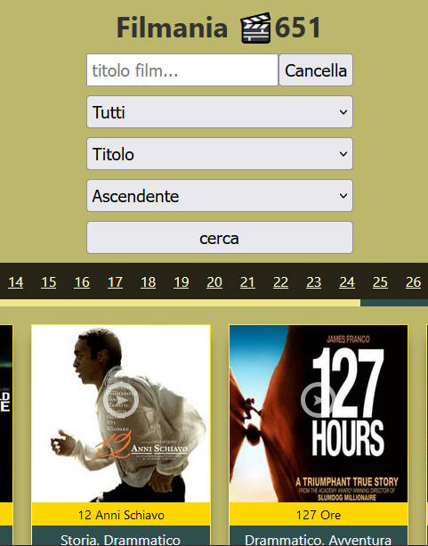

# Filmania

## Filmania is a small project that helps the transition from a film archive present on storage to a webApp.

[Link DEMO](https://marcellopagano.github.io/filmania/)

## The utils folder contains the "fileToJson.js" file, once set this file can be simply called from node, in this way we would create what will be the data file which will then be used in the webapp engine.